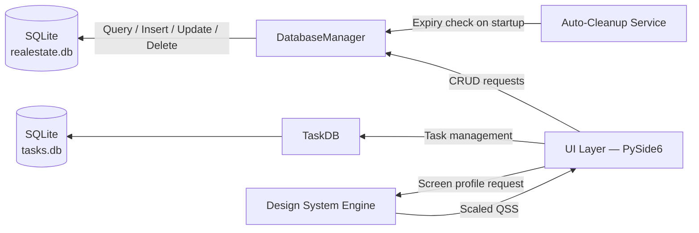

<div align="center">

# 🏛️ Arvin
### A Native Desktop CRM for Real Estate Agencies

**A production-grade, fully offline desktop application for managing property sales, rentals, client requests, and construction partnerships — architected and built end-to-end in Python & Qt.**

[](https://www.python.org/)
[](https://doc.qt.io/qtforpython/)
[](https://www.sqlite.org/)
[](#)
[](#)
[](#)

</div>

<br>

> **Note on this repository.** Arvin is a commercial, closed-source product built for a real estate agency. For confidentiality reasons, the source code is not published here. This repository instead documents the system's architecture, engineering decisions, and real screenshots/recordings from production use — as a portfolio reference of my work as its sole developer.

<br>

## Contents

- [Preview](#-preview)
- [Overview](#-overview)
- [Engineering Highlights](#-engineering-highlights)
- [Feature Set](#-feature-set)
- [Tech Stack](#-tech-stack)
- [Architecture](#-architecture)
- [Running the Project](#-running-the-project)
- [About the Developer](#-about-the-developer)

<br>

## 🖼 Preview

<div align="center">

| Dashboard | Work Calendar (Jalali / Hijri) |
|:---:|:---:|
|  |  |

| Property Form | Filtered Property List |
|:---:|:---:|
|  |  |

**Recorded walkthrough of the live application:**


</div>

> *Replace the placeholders above with real screenshots and a screen recording from the running application, placed under `docs/screenshots/`.*

<br>

## 🧭 Overview

**Arvin** is a fully offline Windows desktop application built for real estate agencies operating in the Iranian market. It replaces paper ledgers and scattered spreadsheets with a single, cohesive system covering an agency's entire operational workflow — from listing intake to daily task management — with no internet dependency, no backend server, and no external installation step for the end user.

The application is distributed as a **single standalone Windows executable**, built with PyInstaller and branded with a custom icon. The end user installs nothing beyond the app itself: no Python runtime, no database server, no network configuration.

This project was scoped, designed, and delivered **independently**, for a paying client, from initial requirements through to a distributable production build.

<br>

## 📌 Engineering Highlights

*A quick summary of the technical work behind this project, for reviewers scanning for substance:*

- Designed and implemented a **custom responsive UI-scaling engine** for Qt — a framework with no native responsive layout system — including runtime screen-size detection and a QSS pre-processor for dimension and font scaling.
- Built a **dual-calendar system** (Jalali solar + Hijri lunar) from first principles, including a curated dataset of Iranian national and religious holidays.
- Designed a **layered architecture** (data / persistence / business logic / presentation) with an ORM-free, dependency-light SQLite data layer, including automatic, non-destructive schema migration.
- Implemented **time-aware business automation**: a two-stage notification engine and a rule-based auto-expiry/cleanup system driven by localized date arithmetic.
- Delivered a **complete RTL-native UI** in Persian, with custom bidirectional number and phone formatting, avoiding floating-point errors in financial fields via `Decimal`-based arithmetic.
- Owned the **full packaging and distribution pipeline** — from source to a signed-icon, single-file Windows executable — via a reproducible, scripted build process.

<br>

## 🗂 Feature Set

### Listing Management — Five Business Categories
A classification system covering every scenario the agency's day-to-day operations require:

| Category | Description |
|---|---|
| For Sale | Full property listings ready for sale |
| For Rent | Rental listings with deposit and monthly rent |
| Buy Requests | Buyer requirements and budget tracking |
| Rent Requests | Tenant requirements tracking |
| Construction Partnerships | Separate owner / investor workflow for joint-development deals |

Each record captures region, property type, area, year built, room count, floor, unit count, orientation, pricing, and full contact details, with fields and validation adapting dynamically to the selected category.

### 📊 Dashboard
- Live statistics computed directly from the database, broken down by category.
- A **two-stage task notification engine**: from 20:00 the dashboard surfaces tomorrow's tasks; at midnight the same notification automatically transitions to today's tasks, driven by an internal timer re-evaluating state every 60 seconds without requiring a restart.
- **Expiry alerts** for listings within five days of automatic deletion, surfaced as clickable, high-visibility notifications.
- A recent-activity feed and an embedded mini work-calendar, kept in sync with the full calendar view.

### 🗓 Dual-Calendar Work Scheduler
- A complete **Jalali (Solar Hijri)** calendar with simultaneous **Hijri (Lunar)** date display for religious occasions.
- A built-in dataset of official Iranian national and religious holidays, rendered with dedicated highlight styling.
- Full task lifecycle management — create, edit, delete, mark-as-done — with time, type, priority, and free-text notes.
- A compact mini-calendar widget embedded in the dashboard, deep-linked to the full calendar view.

### ⏱ Automated Listing Lifecycle
- Rule-based **auto-expiry**: listings older than 91 days from their recorded date are purged automatically on startup, with a summary notification of what was removed.
- Expiry is computed against Jalali dates rather than naive date arithmetic.

### 🔎 Search & Advanced Filtering
- Instant search across region, contact name, phone number, address, and property type.
- An **advanced search dialog** with dynamic range filters (price, deposit, rent, area, room count), where visible fields adapt to the selected listing category.
- Category-aware list views, columnized by property usage or partnership role, each with a live per-column counter.

### 📐 A Custom Responsive Design Engine
The most technically distinctive part of the codebase — a purpose-built scaling engine for Qt:
- Detects the user's screen resolution at runtime and computes an appropriate scale factor, from small laptop displays to 4K monitors.
- A custom QSS pre-processor that rewrites scale-tagged dimensions and font sizes in the stylesheet at runtime, based on the detected profile.
- HiDPI-aware, with a global font-legibility pass applied consistently across the interface.
- Custom smooth, pixel-based scrolling for tables and forms, replacing Qt's default line-based scrolling.

### 🌐 Localization & Interface Craftsmanship
- Complete **right-to-left (RTL)** layout across every page, dialog, and table, built from purpose-composed RTL widget layouts rather than a superficial mirror transform.
- Custom number and phone formatters with correct bidirectional rendering.
- Financial values validated and rounded using `Decimal`, not `float`, eliminating floating-point rounding errors in monetary fields.
- Context-aware autocomplete on fields such as region, sourced dynamically from existing records.

### 🧱 Architecture & Code Quality
- A clean, layered architecture: `models` (data structures) → `database` (SQLite CRUD layer) → `services` (business logic) → `ui` (presentation).
- SQLite as the single source of truth, deliberately kept free of an ORM for maintainability at this project's scale.
- **Automatic schema migration** — new columns are added to existing, already-deployed databases on startup without data loss.
- Full support for PyInstaller's frozen runtime — resource and database paths resolve correctly whether run from source or from the packaged executable.

### 📦 Production Packaging
- A dedicated Windows build script that installs dependencies, configures PyInstaller, and bundles the custom brand icon automatically.
- Output: a self-contained `.exe` with a custom application icon, requiring no Python runtime on the target machine.

<br>

## ⚙ Tech Stack

| Layer | Technology | Purpose |
|---|---|---|
| Language | **Python 3.11+** | Core application logic |
| UI Framework | **PySide6 (Qt 6)** | Native, cross-platform desktop UI |
| Database | **SQLite** | Lightweight, serverless local persistence |
| Solar Calendar | **jdatetime** | Jalali date calculations and rendering |
| Lunar Calendar | **hijri-converter** | Hijri date conversion for religious occasions |
| Localization | **persiantools** | Persian text and number utilities |
| Packaging | **PyInstaller** | Standalone Windows executable build |
| Styling | **QSS** + a custom scaling engine | Responsive, theme-consistent UI |

<br>

## 🏗 Architecture

```
RealEstateManager/
│
├── main.py                     # Entry point — dev & PyInstaller-frozen aware
│
├── models/                     # Data layer
│   └── property.py             # Property dataclass, category constants & labels
│
├── database/                   # Data access layer
│   ├── db_manager.py           # CRUD + automatic SQLite schema migration
│   └── task_db.py              # Independent SQLite store for calendar tasks
│
├── services/                   # Business logic layer
│   └── auto_cleanup.py         # Jalali-date-based expiry computation & cleanup
│
├── ui/                         # Presentation layer
│   ├── design_system.py        # Responsive scaling engine & QSS pre-processor
│   ├── responsive.py           # Responsive layout & smooth-scroll helpers
│   ├── formatters.py           # Number, phone, and bidirectional-text formatting
│   ├── main_window.py          # Main window shell & sidebar navigation
│   ├── dashboard.py            # Statistics dashboard & notification engine
│   ├── work_calendar.py        # Dual-calendar (Jalali/Hijri) work scheduler
│   ├── add_task_dialog.py      # Task create/edit dialog
│   ├── property_list.py        # Filterable, columnized property list views
│   ├── property_form.py        # Property create/edit form
│   ├── property_details.py     # Full property detail view
│   ├── partnership_list.py     # Partnership listing views (owner/investor)
│   ├── partnership_form.py     # Partnership create/edit form
│   ├── partnership_details.py  # Partnership detail view
│   ├── advanced_search.py      # Dynamic, category-aware advanced search dialog
│   └── styles/main.qss         # Application stylesheet
│
├── assets/                     # Brand icon & logo
├── requirements.txt            # Python dependencies
├── build_windows.bat           # Automated Windows packaging script
└── Arvin.spec                  # PyInstaller build configuration
```

### Data Flow



<br>

## 🖥 Running the Project

> As noted above, the full source is not published in this repository. The commands below reflect the project's structure for context.

```bash
# Install dependencies
pip install -r requirements.txt

# Run in development mode
python main.py
```

**Building the Windows executable:**

```bat
build_windows.bat
```

The build is produced at `dist/Arvin/Arvin.exe`; the script installs dependencies, configures PyInstaller, and applies the branded application icon automatically.

<br>

## 👤 About the Developer

This project was designed and built **entirely solo** — from data modeling and system architecture, through the custom responsive UI engine and dual-calendar system, to business-logic automation and the final Windows packaging pipeline.

I'm open to discussing this project in more depth, or hearing feedback — feel free to reach out via the contact details on my GitHub profile.

<br>

<div align="center">

If this project was useful as a reference, a star on the repository is appreciated.

</div>
